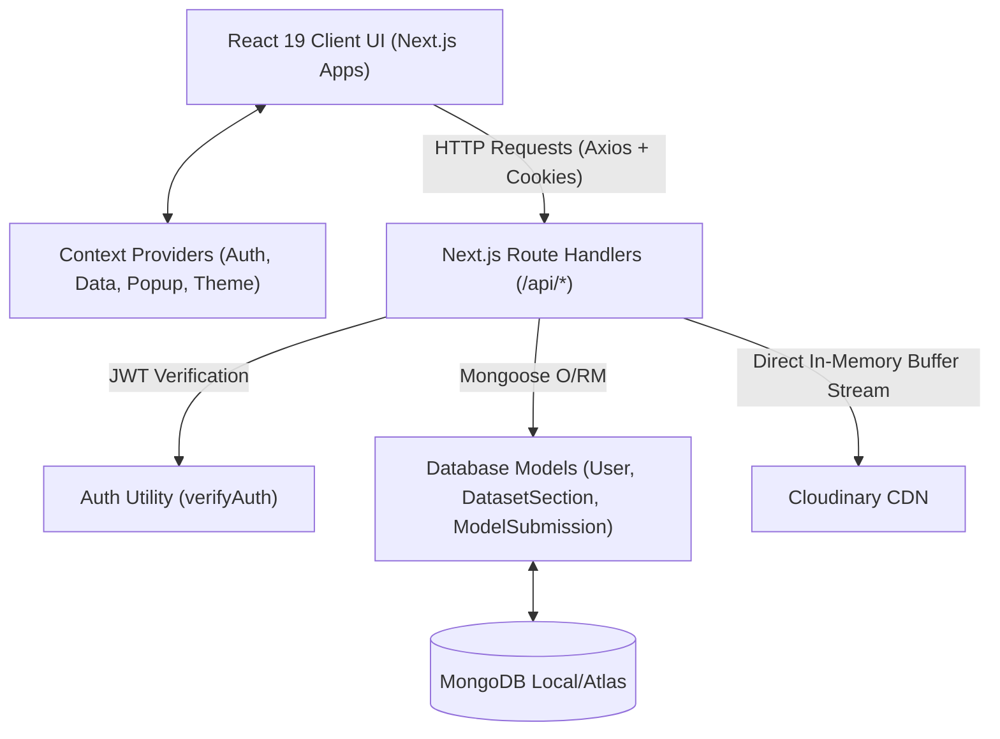
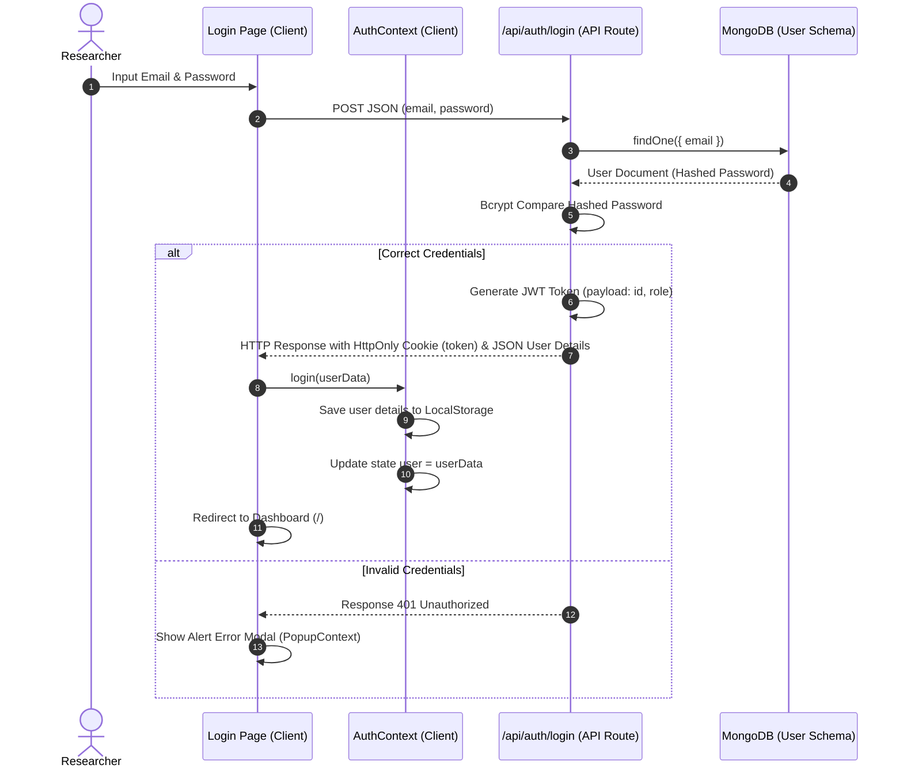
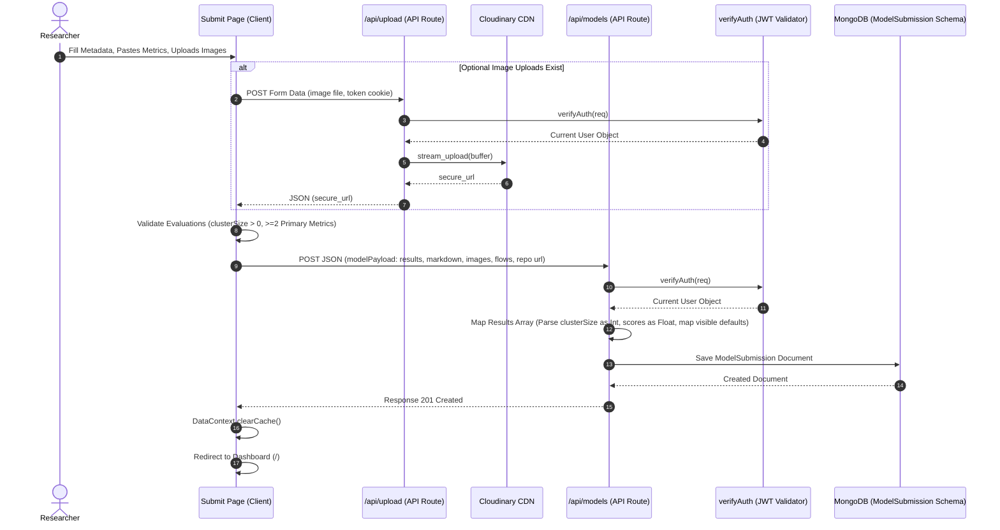
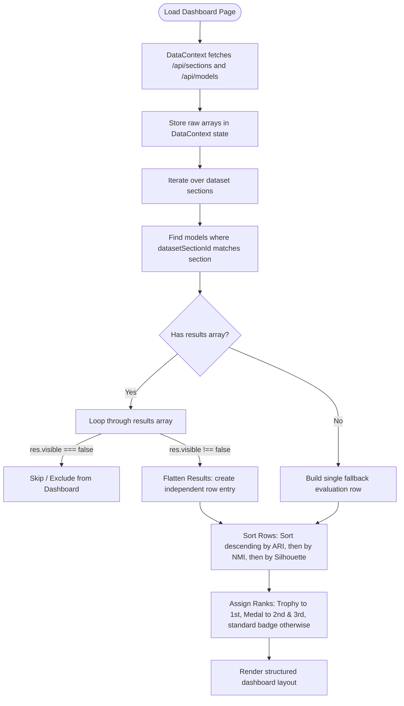
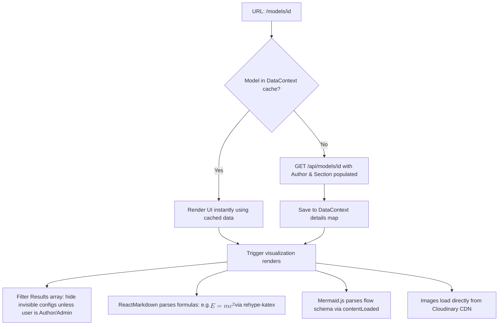
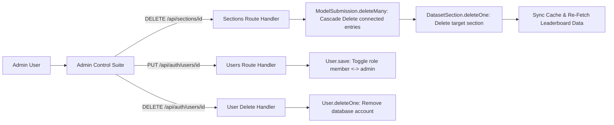
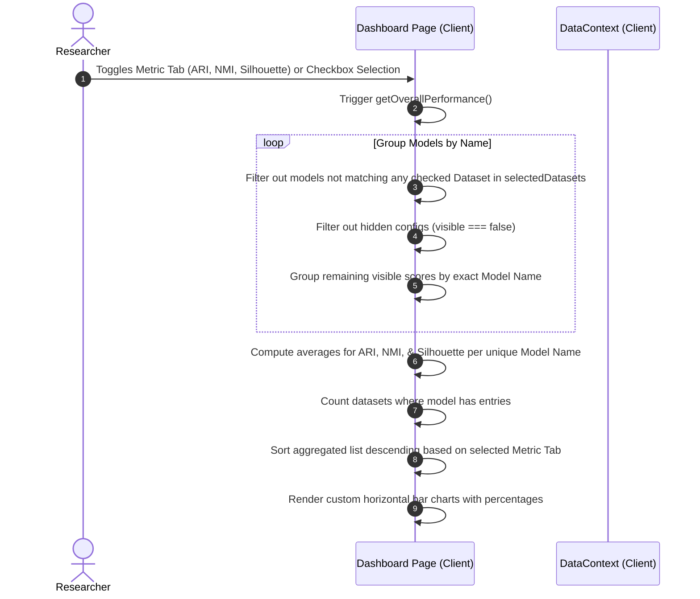
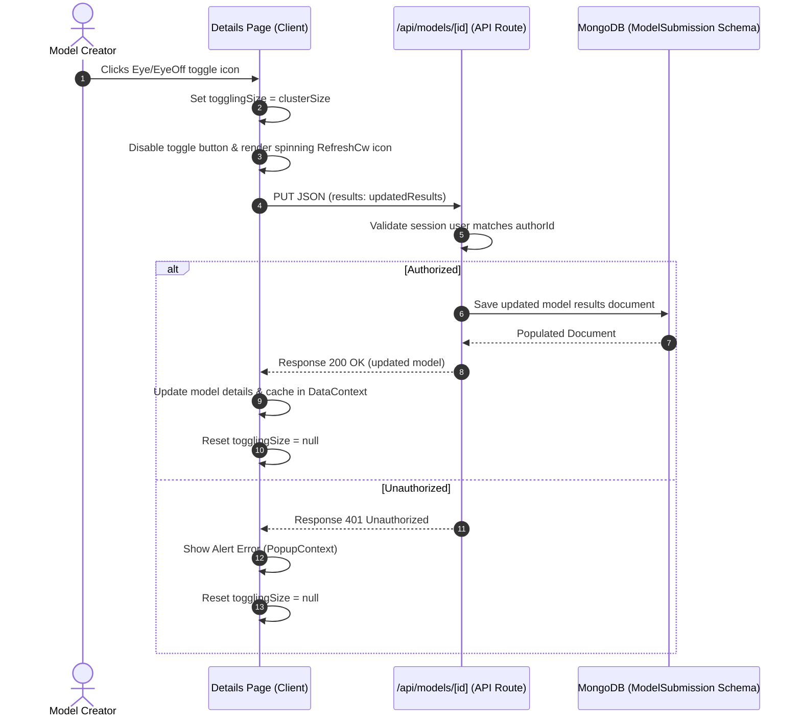
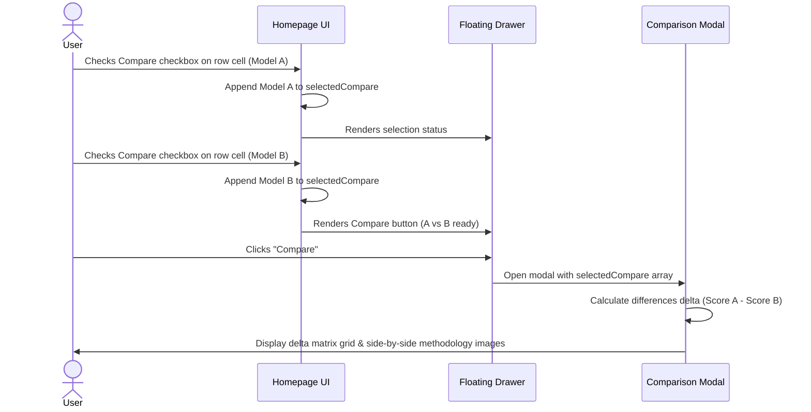
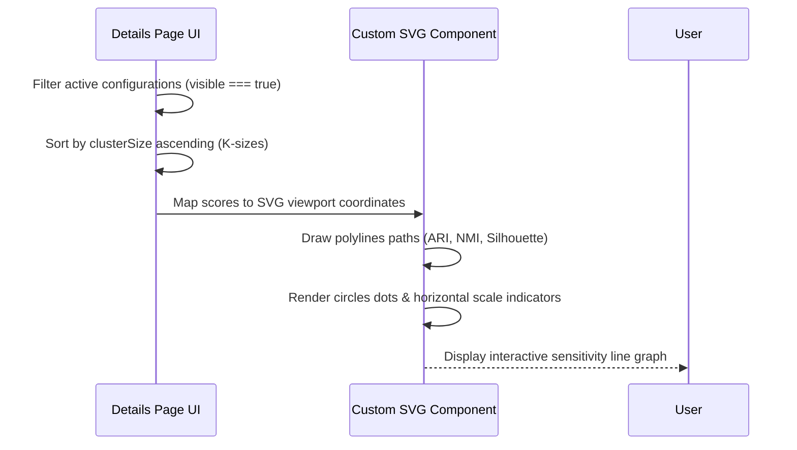

# SpatialAblate - Spatial Multi-Omics Leaderboard
## System Architecture & Data Flow Documentation

This document provides a comprehensive technical mapping of the data flow, database schemas, API routes, and client-side integration patterns of the **SpatialAblate** benchmarking platform.

---

## 1. High-Level Architectural Overview

SpatialAblate is built as a clinical-grade, modern web application utilizing a unified full-stack architecture:

- **Frontend**: Next.js 16 (App Router) using React 19 Client Components (`'use client'`) for responsive dashboard statistics and real-time interactive pages.
- **Styling**: Tailwind CSS v4 featuring CSS variables, dynamic dark/light theme options, and custom overlay/popup modules.
- **State Management**: Context-scoped providers (`AuthContext`, `DataContext`, `PopupContext`, `ThemeContext`) wrapping the client tree to orchestrate global state and data caches.
- **Backend Handlers**: Serverless Next.js API route handlers fetching/writing data to the database and external CDNs.
- **Database Layer**: MongoDB managed via Mongoose schemas with transaction safety checks and validation pre-hooks.
- **External CDN**: Cloudinary for serverless-friendly, in-memory stream uploading of mathematical methodology graphics and figures.



---

## 2. Database Models (Entity Reference)

Data integrity is preserved inside MongoDB using three primary Mongoose schemas:

### A. User Schema (`src/models/User.js`)
Stores account credentials, profile configurations, and administration permissions.
- **Fields**:
  - `name` (String, required): Researcher name.
  - `email` (String, unique, required): Account login email.
  - `password` (String, required): Hashed credential storage.
  - `image` (String, optional): Avatar image URL.
  - `role` (String, enum: `['member', 'admin']`, default: `'member'`): Access level.
- **Timestamps**: Automated `createdAt` and `updatedAt`.

### B. DatasetSection Schema (`src/models/DatasetSection.js`)
Represents the individual spatial multi-omics benchmark datasets.
- **Fields**:
  - `name` (String, required): Key identifier (e.g., `Human_Lymph_Node_A1`).
  - `description` (String, optional): Explanation of dataset metrics.
  - `groundTruth` (Number, optional): Reference cluster size validation count.
- **Timestamps**: Automated `createdAt` and `updatedAt`.

### C. ModelSubmission Schema (`src/models/ModelSubmission.js`)
Captures model evaluation reports, metrics, pipeline graphs, and uploaded source figures.
- **Results Array Schema** (`clusterResultSchema`):
  - `clusterSize` (Number, required)
  - `scoreARI` (Number)
  - `scoreNMI` (Number)
  - `scoreSilhouette` (Number)
  - `scoreAMI` (Number)
  - `scoreHomogeneity` (Number)
  - `scoreVMeasure` (Number)
  - `visible` (Boolean, default: `true`): Visibility state configuration. Allows authors to hide specific configurations from the leaderboard.
- **ModelSubmission Schema**:
  - `name` (String, required): Algorithm/Submission name.
  - `authorId` (ObjectId, ref: `'User'`, required): Creator reference.
  - `datasetSectionId` (ObjectId, ref: `'DatasetSection'`, required): Associated benchmark section.
  - `results` (`[clusterResultSchema]`, required): Multi-resolution benchmarking results. Contains custom validation checks.
  - `descriptionMarkdown` (String, required): Scientific markdown & LaTeX math equations.
  - `methodologyImages` (`[String]`): cloud storage URLs.
  - `architectureFlow` (String, optional): Mermaid.js diagram code.
  - `githubUrl` (String, optional): Code repository URL.
- **Legacy Fallback Hooks**:
  - `post('init')`: Detects legacy submission columns (`clusterSize`, `scoreARI`, etc.) and dynamically builds a results array entry containing `visible: true` for backward database compatibility.
  - `pre('validate')`: Validates that at least one cluster evaluation exists, sizes are unique positive integers, and at least two of the primary metrics (`scoreARI`, `scoreNMI`, `scoreSilhouette`) are provided.

---

## 3. Core Data Flow Scenarios

### Scenario A: Authentication & Session Management
The authentication flow utilizes secure `HttpOnly` cookie-based JWT sessions alongside client local storage variables to allow authorization persistence.



1. **Client Submission**: The researcher inputs email and password credentials on `/login`.
2. **Database Lookup**: The API `/api/auth/login` checks the database for user presence.
3. **Bcrypt Compare**: Password hash verification is executed on the server.
4. **Tokenization & Cookie Dispatch**: Upon success, a JWT is signed. A secure, `HttpOnly`, `SameSite: strict` cookie named `token` containing this JWT is written onto the client browser.
5. **State Sync**: The client-side `AuthContext` receives user details in the JSON body, cache-saves them into `localStorage`, and updates React UI state.

---

### Scenario B: Model Submission & Image Upload Flow
This flow tracks how a model's evaluations, markdown instructions, and figures are processed and written.



1. **File Uploading**: If the researcher uploads gallery files, the client sends a `multipart/form-data` request containing the files to `/api/upload`.
2. **Buffer Conversion**: The `/api/upload` endpoint converts file arrays into a Node.js `Buffer`.
3. **Cloudinary Stream**: The buffer is piped directly into Cloudinary using `cloudinary.uploader.upload_stream` under the `leaderboard-methodologies` namespace.
4. **Validation Check**: The client verifies that at least two primary metrics are filled per cluster evaluation.
5. **Database Transaction**: A POST request containing the mapped parameters is sent to `/api/models`. The route handler validates authorization via the cookies/bearer headers, parses values, and performs a database `save()` transaction.
6. **Cache Reset**: Client cache is cleared via `DataContext.clearCache()` to ensure fresh dashboard renders.

---

### Scenario C: Dashboard Leaderboard Fetch & Ranking Flow
Retrieves data dynamically, filters visibility status, and ranks algorithms.



1. **Global Fetch**: On dashboard load (`src/app/page.js`), `DataContext.fetchGlobalData()` calls `GET /api/sections` and `GET /api/models` concurrently using `Promise.all`.
2. **Visibility Check**: When rendering individual dataset leaderboards, the system maps model evaluations. If an evaluation config has `visible === false`, it is ignored and excluded from the row lists.
3. **Data Flattening**: Active configurations are flattened into independent row entries:
   ```javascript
   {
     _id: model._id,
     resultKey: `${model._id}-${res.clusterSize}`,
     name: model.name,
     clusterSize: res.clusterSize,
     scoreARI: res.scoreARI,
     scoreNMI: res.scoreNMI,
     scoreSilhouette: res.scoreSilhouette
   }
   ```
4. **Comparison sorting**: Rows under each dataset section are sorted dynamically:
   - Primary Sort: **ARI** (Adjusted Rand Index) descending.
   - Secondary Sort: **NMI** (Normalized Mutual Information) descending.
   - Tertiary Sort: **Silhouette Coefficient** descending.
5. **Rank Designation**: Icons (Trophy, Medal, Badges) are assigned, and the list is rendered in a responsive CSS table layout.

---

### Scenario D: Single Model Details & Visualizations
Shows individual submission blueprints with mathematical renderings.



- **Caching**: The client first checks if the model is cached inside `DataContext.modelDetails[id]`. If missing, it dispatches a GET request to `/api/models/[id]`.
- **Visibility Filtration**: The client calculates `displayResults` and filters out configs where `visible === false` unless the viewer is authorized to edit the submission (author or admin). Authors/admins see hidden configs marked with a "Hidden from Dashboard" badge.
- **LaTeX Math Rendering**: `react-markdown` combines with `remark-math` and `rehype-katex` to transform equations (enclosed in `$$` or `$`) into interactive LaTeX formulas.
- **Mermaid Graph Initialization**: Upon initial render, the client triggers `mermaid.initialize()` and `mermaid.contentLoaded()` to compile raw string flowcharts (e.g., `graph TD; A --> B;`) into interactive pipeline SVGs.

---

### Scenario E: Administrative Operations
The Admin Panel features CRUD dashboards with referential data checks.



- **Authentication Guard**: Admin routes check `currentUser.role === 'admin'`. Unauthorized requests trigger automatic redirection.
- **Cascade Deletion**: When an administrator deletes a `DatasetSection`, the backend executes `ModelSubmission.deleteMany({ datasetSectionId: section._id })` before deleting the section itself, ensuring no orphaned metrics exist in MongoDB.
- **Hidden Badges**: The Admin dashboard lists all submissions. If an evaluation config has `visible === false`, the list displays an `EyeOff` "Hidden" badge next to the entry name.

---

### Scenario F: Overall Model Performance Aggregation
Computes aggregated metrics and displays system-wide performance comparison statistics with metric tabs and multi-select dataset checkboxes.



1. **Aggregation Process**: On dashboard render, the client triggers `getOverallPerformance()`, which scans all model submissions loaded inside `DataContext`.
2. **Dataset Filtering**: A custom multi-select checkbox dropdown holds a list of selected dataset IDs in `selectedDatasets`. Submissions that belong to datasets not checked by the researcher are dynamically excluded from overall scoring.
3. **Grouping by Name**: It groups visible configurations (`visible !== false`) by their exact name string, gathering all scores (ARI, NMI, Silhouette) and mapping unique dataset section IDs.
4. **Averages Calculation**: Averages are computed for each metric.
5. **Interactive Sorting**: The resulting model comparison list is sorted descending based on the active selected metric tab (`ARI`, `NMI`, or `Silhouette`).
6. **Horizontal Progress Gauges**: Displayed as custom SVG/CSS progress bars. The leader holds a Trophy badge.

---

### Scenario G: Evaluation Visibility Toggle (Author-Only)
Allows model creators to hide/unhide specific cluster configurations directly from the detail views.



1. **Author Check**: The details page evaluates `isAuthor` (`currentUser._id === model.authorId`). If true, an interactive Eye toggle button is rendered.
2. **Spinner Toggle**: Upon clicking the eye icon, the client sets `togglingSize` to the target cluster size, disabling the button and displaying an animated loading spinner (`RefreshCw`).
3. **Database Save**: A PUT request `/api/models/[id]` is dispatched to the backend containing the toggled results array.
4. **Backend Guard**: The backend route verify authorization tokens, checks that `model.authorId` matches the session user, updates the results document, and returns the populated model object.
5. **UI Update**: Client updates local state and cached datasets, then clears the `togglingSize` state to restore normal rendering views.

---

## 4. Middleware & Authorization Safeguards

Security operations on backend routes are protected using the `verifyAuth` helper function inside `src/lib/auth.js`:

1. **Cookie Parsing**: Extracts session tokens from NextRequest client cookies (`req.cookies.get('token')`).
2. **Authorization Header**: Fallback checks for standard Bearer tokens (`req.headers.get('authorization')`).
3. **Verification**: Decodes the token using `jwt.verify` against `process.env.JWT_SECRET`.
4. **Database Verification**: Performs `User.findById(decoded.id).select('-password')` to retrieve verified user document details (omitting credentials) before proceeding to execution logic.

---

## 5. Comparative Analysis & Visualization Scenarios

### Scenario H: Side-by-Side Model Comparison

1. **Selection**: User clicks rows selection checkboxes which tracks checked models inside `selectedCompare` local state array.
2. **Drawer Alert**: A floating bottom drawer displays the names and configurations of selected models.
3. **Delta Calculation**: Clicking compare opens an overlay modal. The component reads the populated `score` parameters directly from the local data cache and computes delta margins, applying green tags for positive differences and red tags for negative differences.
4. **Methodology Image Comparative**: Modal renders methodology graphics side-by-side for comparative overview.

### Scenario I: Cluster Sensitivity Parameter Visualizer

1. **Preprocessing**: The model details page filters evaluations array to extract visible configurations, sorting them by `clusterSize` ascending.
2. **SVG Coordinates Mapping**: Converts mathematical scores (0 to 1) and cluster values (min to max K size) into normalized canvas pixel space.
3. **Polylines Rendering**: Renders custom SVG polylines for Adjusted Rand Index, Normalized Mutual Information, and Silhouette metrics with distinct color schemes.
4. **Grid Overlay**: Draws dasharray scales and axis label tags.

