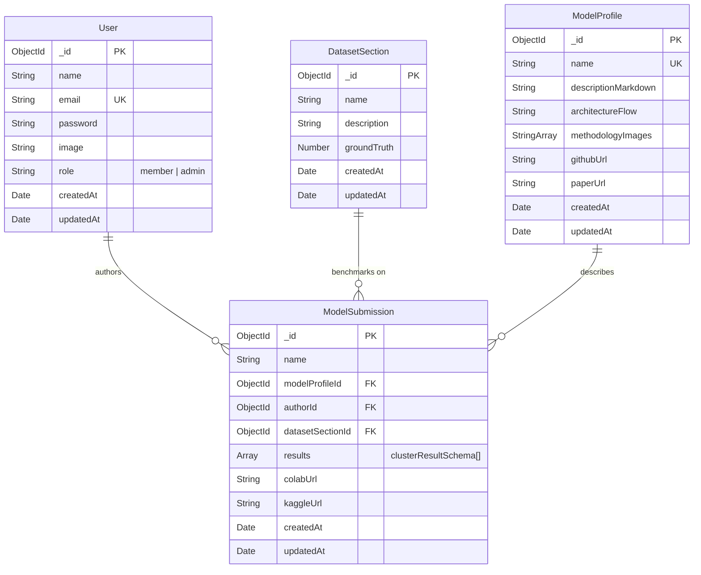
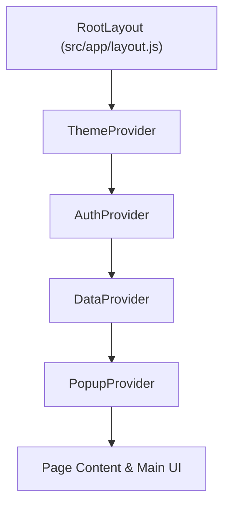

# SpatialAblate - Complete System Architecture, Database Schema & Storage Configuration Guide

> **Document Version**: 1.0.0  
> **Last Updated**: July 2026  
> **Target Audience**: Developers, System Architects, Researchers & Maintainers  

---

## 1. Executive Summary & Platform Overview

**SpatialAblate** is a clinical-grade, high-performance web platform designed for benchmarking, tracking, and comparing spatial bioinformatics algorithms and multi-omics integration models. 

### Key Capabilities
- **Multi-Resolution Benchmarking**: Evaluates clustering performance across variable cluster sizes ($K$-sizes) using 6 standard bioinformatics metrics: **ARI** (Adjusted Rand Index), **NMI** (Normalized Mutual Information), **Silhouette Coefficient**, **AMI** (Adjusted Mutual Info), **Homogeneity**, and **V-Measure**.
- **Decoupled Architecture**: Separates immutable model metadata (methodology descriptions, mathematical formulation, Mermaid pipeline flowcharts, GitHub repository links, research paper citations) into shared **Model Profiles**, allowing a single model to submit evaluation runs across multiple benchmark dataset sections without redundant metadata duplication.
- **Dynamic Leaderboards**: Interactive dashboard displaying dataset-specific rankings sorted hierarchically by primary metrics ($\text{ARI} \downarrow \rightarrow \text{NMI} \downarrow \rightarrow \text{Silhouette} \downarrow$) with visibility controls for author masking.
- **Overall Performance Aggregator**: Computes normalized cross-dataset performance averages for models with interactive dataset filtering controls.
- **Rich Media & Math Rendering**: Supports native LaTeX math expressions rendered via KaTeX, dynamic flowchart generation via Mermaid.js, and multi-figure methodology image galleries hosted on Cloudinary CDN.
- **Granular Control & Author Visibility**: Author/Admin toggleable evaluation visibility ($K$-size configs can be hidden/unhidden without deleting data).
- **Side-by-Side Comparison Matrix**: Compare any two models in real time with calculated score deltas and side-by-side figure rendering.

---

## 2. Technical Stack & Technology Mapping

| Layer | Technology | Version | Purpose / Role |
| :--- | :--- | :--- | :--- |
| **Framework** | Next.js (App Router) | `16.2.9` | Full-stack SSR/SSG & Edge Serverless API route handlers |
| **Frontend Library** | React | `19.2.4` | Component-based UI with Client Components (`'use client'`) |
| **Icons & UI** | Lucide React | `1.22.0` | Modern SVG iconography |
| **Animations** | Framer Motion | `12.42.0` | UI animations and transition effects |
| **Styling Engine** | Tailwind CSS / PostCSS | `4.0.0` | Design system with custom HSL CSS variables & dark mode |
| **State Management** | React Context API | Native | Distributed global state (`Auth`, `Data`, `Popup`, `Theme`) |
| **Database & ODM** | MongoDB / Mongoose | `9.7.3` | Document database & Object Data Modeling schemas |
| **Session Security** | JSON Web Tokens (`jsonwebtoken`) | `9.0.3` | Signed session tokens in `HttpOnly`, `SameSite: strict` cookies |
| **Password Hashing** | Bcrypt | `6.0.0` | Salted password hashing (10 rounds) |
| **Asset CDN** | Cloudinary SDK | `2.10.0` | Serverless-friendly stream uploading of images |
| **Math Rendering** | KaTeX / Remark Math / Rehype KaTeX | `0.17.0` | LaTeX math equation rendering (`$$...$$` & `$`) |
| **Diagrams** | Mermaid.js | `11.16.0` | Client-side pipeline flowchart SVG rendering |
| **HTTP Client** | Axios | `1.18.1` | REST API communication with interceptors & caching |

---

## 3. Directory & File Structure

```
FYDP-LeaderBoard-NextJS/
├── .env                           # Environment configurations & secrets
├── .gitignore                     # Git tracking exclusions
├── eslint.config.mjs              # ESLint rules and Next.js preset
├── jsconfig.json                  # Module alias mappings (@/* -> ./src/*)
├── next.config.mjs                # Next.js build & bundler configuration
├── package.json                   # Dependencies, scripts, & engines
├── postcss.config.mjs             # PostCSS processing for Tailwind v4
├── DATA_FLOW.md                   # Sequence diagrams & data flow documentation
├── SYSTEM_ARCHITECTURE.md         # Comprehensive system architecture & schema guide (THIS FILE)
├── public/                        # Static public files & favicons
├── scripts/
│   └── migrate.js                 # Database schema migration script (decouples ModelProfile)
└── src/
    ├── proxy.js                   # Next.js Edge Middleware for route protection
    ├── app/                       # App Router pages and API routes
    │   ├── layout.js              # Root layout & nested provider tree wrapper
    │   ├── page.js                # Main Leaderboard Dashboard page
    │   ├── globals.css            # Tailwind theme tokens & color CSS variables
    │   ├── admin/
    │   │   └── page.js            # Admin Panel management suite
    │   ├── login/
    │   │   └── page.js            # User authentication & registration page
    │   ├── submit/
    │   │   └── page.js            # Model submission & benchmark entry page
    │   ├── models/
    │   │   └── [id]/
    │   │       └── page.js        # Detailed model blueprint & benchmark view
    │   └── api/                   # Serverless backend API handlers
    │       ├── auth/
    │       │   ├── login/route.js # POST: User login & cookie setting
    │       │   ├── logout/route.js# POST: User logout & cookie purge
    │       │   ├── register/route.js # POST: New user registration
    │       │   └── users/route.js # GET: Fetch all users (Admin only)
    │       ├── models/
    │       │   ├── route.js       # GET: Fetch all submissions | POST: Submit model
    │       │   └── [id]/route.js  # GET: Model detail | PUT: Update model | DELETE: Delete model
    │       ├── sections/
    │       │   ├── route.js       # GET: Fetch dataset sections | POST: Create section (Admin)
    │       │   └── [id]/route.js  # DELETE: Delete dataset section with cascade delete (Admin)
    │       └── upload/
    │           └── route.js       # POST: In-memory stream upload to Cloudinary CDN
    ├── components/
    │   ├── Navigation.js          # Top bar navigation, theme toggle & account state
    │   └── Popup.js               # Global modal dialog component (Alerts & Confirmations)
    ├── context/
    │   ├── AuthContext.js         # Authentication session context
    │   ├── DataContext.js         # Global dataset/model data context & local cache
    │   ├── PopupContext.js        # Promise-driven modal alert/confirm context
    │   └── ThemeContext.js        # Dark/Light mode context
    ├── lib/
    │   ├── auth.js                # JWT token signing & request verification middleware
    │   └── db.js                  # MongoDB connection caching & auto-seeding engine
    └── models/                    # Mongoose Data Schemas
        ├── User.js                # User accounts & roles schema
        ├── DatasetSection.js      # Spatial dataset benchmark schema
        ├── ModelProfile.js        # Shared model metadata schema
        └── ModelSubmission.js     # Model evaluation submission schema
```

---

## 4. Database Schema Architecture & Data Model

The application utilizes MongoDB managed via Mongoose. The database design employs a hybrid approach: normalizing static model profiles (`ModelProfile`) while embedding evaluation result arrays (`clusterResultSchema`) within dataset-specific submissions (`ModelSubmission`).



### Detailed Schema Specifications

#### 1. User Schema (`src/models/User.js`)
Stores user accounts, credentials, and access roles.
- `name` (String, required): Researcher's full name.
- `email` (String, required, unique): Unique account email address.
- `password` (String, required): Bcrypt salted password hash.
- `image` (String, optional): URL to profile avatar.
- `role` (String, enum: `['member', 'admin']`, default: `'member'`): Access level.
- `timestamps`: Automatically adds `createdAt` and `updatedAt`.

#### 2. DatasetSection Schema (`src/models/DatasetSection.js`)
Represents spatial multi-omics benchmark datasets.
- `name` (String, required): Dataset section identifier (e.g. `Human_Lymph_Node_A1`, `Mouse_Brain_ATAC`).
- `description` (String, optional): Text summary of dataset modality and features.
- `groundTruth` (Number, optional): Expected true cluster count for validation reference.
- `timestamps`: Automatically adds `createdAt` and `updatedAt`.

#### 3. ModelProfile Schema (`src/models/ModelProfile.js`)
Stores dataset-agnostic model documentation and metadata. Decouples model identity from specific benchmark evaluation runs.
- `name` (String, required, unique, indexed): Unique model name (e.g. `SpatialGlue`, `Seurat_v4`).
- `descriptionMarkdown` (String, required): Full LaTeX math & markdown documentation.
- `architectureFlow` (String, optional): Mermaid.js flowchart code.
- `methodologyImages` (`[String]`, optional): Array of Cloudinary CDN image URLs.
- `githubUrl` (String, optional): Link to open-source repository.
- `paperUrl` (String, optional): Link to published scientific paper.
- `timestamps`: Automatically adds `createdAt` and `updatedAt`.

#### 4. ModelSubmission Schema (`src/models/ModelSubmission.js`)
Stores an evaluation run for a given model on a specific `DatasetSection`.

##### Sub-Document Schema: `clusterResultSchema`
- `clusterSize` (Number, required): Target cluster count ($K$).
- `scoreARI` (Number, optional): Adjusted Rand Index score ($[-1.0, 1.0]$).
- `scoreNMI` (Number, optional): Normalized Mutual Information score ($[0.0, 1.0]$).
- `scoreSilhouette` (Number, optional): Silhouette Coefficient score ($[-1.0, 1.0]$).
- `scoreAMI` (Number, optional): Adjusted Mutual Information score.
- `scoreHomogeneity` (Number, optional): Homogeneity score.
- `scoreVMeasure` (Number, optional): V-Measure score.
- `visible` (Boolean, default: `true`): Visibility state flag. Allows hiding specific $K$ configs from public leaderboards.

##### Primary ModelSubmission Fields
- `name` (String, required): Denormalized model name for fast queries.
- `modelProfileId` (ObjectId, ref: `'ModelProfile'`): Reference to shared profile document.
- `authorId` (ObjectId, ref: `'User'`, required): Reference to the researcher who submitted the run.
- `datasetSectionId` (ObjectId, ref: `'DatasetSection'`, required): Reference to the benchmark dataset section.
- `results` (`[clusterResultSchema]`, required): Array of evaluation results for different cluster sizes.
- `colabUrl` (String, optional): Run-specific Google Colab notebook link.
- `kaggleUrl` (String, optional): Run-specific Kaggle notebook link.
- Legacy fields (`scoreARI`, `scoreNMI`, etc.) retained for backwards compatibility.

##### Schema Validation & Hooks
- `pre('validate')`: Validates that:
  1. At least one cluster evaluation is provided.
  2. `clusterSize` values are positive integers without duplicates.
  3. At least **two primary metrics** (`scoreARI`, `scoreNMI`, `scoreSilhouette`) are provided for every evaluation entry.
- `post('init')`: Automatically converts legacy flat submission documents into the multi-resolution `results` array format on load.

---

## 5. Storage Configurations & Infrastructure Setup

### MongoDB Connection & Caching (`src/lib/db.js`)
- **Connection Reuse**: Uses a global cached connection promise (`global.mongoose`) to prevent socket exhaustion across serverless function invocations.
- **Fast Failure**: Configures `mongoose.set('bufferCommands', false)` and `serverSelectionTimeoutMS: 5000` to prevent serverless request timeouts when MongoDB is unreachable.
- **Auto-Seeding**: Upon connection initialization, the system checks and populates:
  - **Default Benchmark Datasets**: 8 spatial sections (`Human_Lymph_Node_A1`, `Human_Lymph_Node_D1`, `Mouse_Brain_ATAC`, `Mouse_Brain_H3K27ac`, `Mouse_Brain_H3K27me`, `Mouse_Brain_H3K4me`, `Mouse_Spleen`, `Mouse_Thymus`).
  - **Default Admin Account**: Auto-creates admin user if none exists using environment variables `ADMIN_EMAIL` and `ADMIN_PASSWORD`.

### Cloudinary CDN Image Storage (`src/app/api/upload/route.js`)
- **In-Memory Streaming**: Converts uploaded `File` objects directly to `Buffer` and streams to Cloudinary via `cloudinary.uploader.upload_stream`.
- **Zero Local Filesystem Writes**: Designed for read-only serverless runtimes (Vercel, AWS Lambda).
- **Target Folder**: Uploads methodology graphics into the `leaderboard-methodologies` Cloudinary folder.
- **Return Payload**: Returns HTTPS `secure_url` for storage in `methodologyImages`.

### Environment Variables (`.env`)

```env
# Database Connection
MONGO_URI="mongodb+srv://<username>:<password>@<cluster>.mongodb.net/<database>"

# JWT Session Authentication Secret
JWT_SECRET="your-secure-random-jwt-secret-key"

# Cloudinary Storage Credentials
CLOUDINARY_CLOUD_NAME="your_cloud_name"
CLOUDINARY_API_KEY="your_api_key"
CLOUDINARY_API_SECRET="your_api_secret"

# Local Server Port Configuration
PORT=3000

# Optional Defaults for Auto-Seeding
ADMIN_EMAIL="admin@gmail.com"
ADMIN_PASSWORD="admin"
```

---

## 6. Security, Middleware & Authorization Logic

### Next.js Edge Middleware (`src/proxy.js`)
The platform runs edge-level middleware that inspects incoming requests prior to route handler execution:
- **Matcher Rules**: Intercepts `/admin/:path*` and `/submit/:path*`.
- **JWT Verification at the Edge**: Decodes base64url JWT payload (`parseJwt`) without Node.js crypto dependencies.
- **Expiration Check**: Checks `exp` timestamp against `Date.now()`.
- **Role Enforcement**:
  - `/admin`: Redirects to `/login` if unauthenticated/expired; redirects to `/` if `role !== 'admin'`.
  - `/submit`: Redirects to `/login` if unauthenticated/expired.

### Token & Session Lifecycle (`src/lib/auth.js`)
1. **JWT Generation**: `generateToken(id, role)` signs tokens with a 30-day expiration (`expiresIn: '30d'`).
2. **Dual-Channel Cookie & Header Parsing** (`verifyAuth`):
   - **Primary**: Checks Next.js `req.cookies.get('token')` or `cookies()` store for `HttpOnly` cookie.
   - **Fallback**: Checks `Authorization: Bearer <token>` header for backward compatibility.
3. **Database Assertion**: Fetches user document via `User.findById(decoded.id).select('-password')` to ensure account exists and hasn't been disabled.

---

## 7. Client State Architecture & Context System

The frontend wraps the component tree in four specialized React Context Providers in `src/app/layout.js`:



### Context Breakdown

1. **`ThemeContext` (`src/context/ThemeContext.js`)**:
   - Manages dark mode toggle.
   - Persists setting in `localStorage` under key `'theme'`.
   - Modifies document element class (`html.dark`) to activate CSS variable overrides.
   - Hydration safe (`mounted` state check).

2. **`AuthContext` (`src/context/AuthContext.js`)**:
   - Stores current user state (`user`).
   - Syncs session token in `localStorage` and `HttpOnly` backend cookie.
   - Provides `login(userData)` and `logout()` helper functions.

3. **`DataContext` (`src/context/DataContext.js`)**:
   - Centralized data store and cache for `sections`, `models`, and `modelDetails` map.
   - **Caching Strategy**: Prevents redundant network requests by keeping fetched submissions in state.
   - **Cache Modification Handlers**:
     - `fetchGlobalData(force)`: Fetches sections and models concurrently using `Promise.all`.
     - `getModelDetail(id, force)`: Resolves single model view from cache or API.
     - `updateModelInCache(updatedModel)`: Updates model in cache and propagates metadata changes to all associated runs sharing the same model name.
     - `addModelToCache(newModel)`: Inserts new model run into top of array.
     - `deleteModelFromCache(modelId)`: Removes deleted model from cache.
     - `clearCache()`: Resets cache after mutations requiring fresh refetch.

4. **`PopupContext` (`src/context/PopupContext.js`)**:
   - Replaces native browser alert/confirm modals with accessible dialogs.
   - **Promise-Driven API**:
     - `showAlert(title, message, type)`: Returns `Promise<void>` that resolves when the user clicks "OK".
     - `showConfirm(title, message, type)`: Returns `Promise<boolean>` that resolves to `true` (Confirm) or `false` (Cancel).

---

## 8. Core Workflows & Business Logic

### A. Model Submission & Metadata Auto-Completion Flow
1. User navigates to `/submit`.
2. As the user types in the **Model Name** field, `src/app/submit/page.js` searches `DataContext.models` for existing matching names.
3. If an existing `ModelProfile` is selected:
   - The UI automatically locks in the shared metadata (Markdown, images, flowchart, GitHub URL, Paper URL).
   - Redundant input fields (description, image uploader, flow editor) are hidden from the DOM.
   - The researcher only enters dataset-specific inputs: **Dataset Section**, **Cluster Size Evaluations**, **Google Colab URL**, and **Kaggle URL**.
4. Upon form submission:
   - Optional methodology images are uploaded via `POST /api/upload`.
   - The payload is posted to `POST /api/models`.
   - The backend creates or links the `ModelProfile`, creates the `ModelSubmission`, clears client cache via `clearCache()`, and redirects to the dashboard.

### B. Dynamic Leaderboard Sorting & Ranking Algorithm
1. Dashboard loads models and sections via `DataContext.fetchGlobalData()`.
2. Model evaluation results are flattened per cluster size configuration ($K$).
3. **Visibility Filter**: Configurations with `visible === false` are filtered out from the dashboard.
4. **Hierarchical Sorting Rules**:
   - **Primary**: Higher `scoreARI` wins.
   - **Secondary** (Tie-breaker 1): Higher `scoreNMI` wins.
   - **Tertiary** (Tie-breaker 2): Higher `scoreSilhouette` wins.
5. **Badge Assignment**:
   - Rank 1: Gold Trophy (`Trophy` icon).
   - Rank 2: Silver Medal (`Medal` icon).
   - Rank 3: Bronze Medal (`Medal` icon).
   - Rank 4+: Standard numerical rank badge.

### C. Single Cluster Visibility Toggle (Author / Admin Only)
1. On the model detail page (`/models/[id]`), the system checks if `currentUser._id === model.authorId` or `currentUser.role === 'admin'`.
2. If authorized, an interactive `Eye` / `EyeOff` icon appears next to each cluster size result.
3. Clicking the icon triggers `PUT /api/models/[id]` updating the `visible` property of that specific cluster result.
4. The detail view displays hidden configs with a "Hidden from Dashboard" warning tag while preventing non-authors/public visitors from viewing them.

### D. Side-by-Side Model Comparison Matrix
1. Users select models on the dashboard using row checkboxes.
2. Selected model IDs are stored in `selectedCompare` array state.
3. Clicking **Compare** opens a side-by-side modal displaying:
   - Mathematical metric comparison grid.
   - Calculated delta values ($\Delta = \text{Score}_A - \text{Score}_B$) color-coded green (positive) or red (negative).
   - Dual column methodology figure rendering.

---

## 9. Database Schema Migration Script (`scripts/migrate.js`)

When upgrading older SpatialAblate databases where model metadata was embedded directly inside individual `ModelSubmission` documents:
- Run the migration script using Node.js:
  ```bash
  node scripts/migrate.js
  ```
- **Migration Logic**:
  1. Connects to `MONGO_URI`.
  2. Queries all `ModelSubmission` documents.
  3. Groups submissions by normalized model name (`sub.name.trim()`).
  4. For each model name group:
     - Checks if a `ModelProfile` already exists.
     - If missing, identifies the submission with the most complete documentation/image metadata and creates a new `ModelProfile`.
     - Updates all `ModelSubmission` documents in that group to reference `profile._id`.

---

## 10. Developer Guide: How to Extend or Modify

### 1. Adding a New Evaluation Metric (e.g., Adjusted Rand Index extension)
To add a new metric (e.g., `scoreF1`):
1. **Update Schemas**:
   - In `src/models/ModelSubmission.js`, add `scoreF1: { type: Number }` to both `clusterResultSchema` and `modelSubmissionSchema`.
   - Update `pre('validate')` if `scoreF1` should count towards minimum required metrics.
2. **Update Submission Form**:
   - In `src/app/submit/page.js`, add an input column for the new metric.
3. **Update API Route Handlers**:
   - In `src/app/api/models/route.js` and `src/app/api/models/[id]/route.js`, parse `scoreF1: res.scoreF1 !== undefined ? parseFloat(res.scoreF1) : undefined`.
4. **Update UI Components**:
   - Update table headers and ranking logic in `src/app/page.js`, `src/app/models/[id]/page.js`, and `src/app/admin/page.js`.

### 2. Changing the Storage Adapter (e.g., AWS S3 instead of Cloudinary)
1. Replace `cloudinary` dependency in `package.json` with `@aws-sdk/client-s3`.
2. Modify `src/app/api/upload/route.js` to upload the buffer using S3 `PutObjectCommand`.
3. Update environment variables in `.env` to include AWS bucket credentials.

### 3. Modifying User Roles or Permissions
- Update `role` enum in `src/models/User.js`.
- Modify Edge middleware rules in `src/proxy.js`.
- Update API authorization checks in `src/lib/auth.js` and `/api/*` endpoints.

---

## 11. Verification & Testing Checklist

- [x] **Database Connectivity**: Verified cached MongoDB connection pooling in `src/lib/db.js`.
- [x] **Authentication**: Verified JWT cookie issue/purge flow in `/api/auth/login` and `/api/auth/logout`.
- [x] **Middleware Guard**: Verified Edge redirect execution in `src/proxy.js`.
- [x] **File Uploads**: Verified in-memory buffer stream uploading to Cloudinary in `/api/upload`.
- [x] **Model Profile Decoupling**: Verified migration script (`scripts/migrate.js`) and relation linking in `/api/models`.
